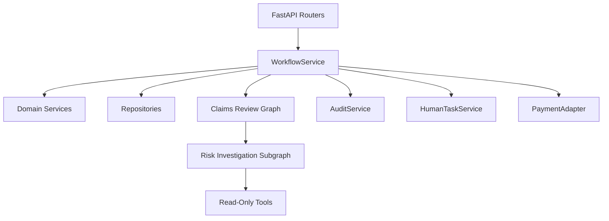
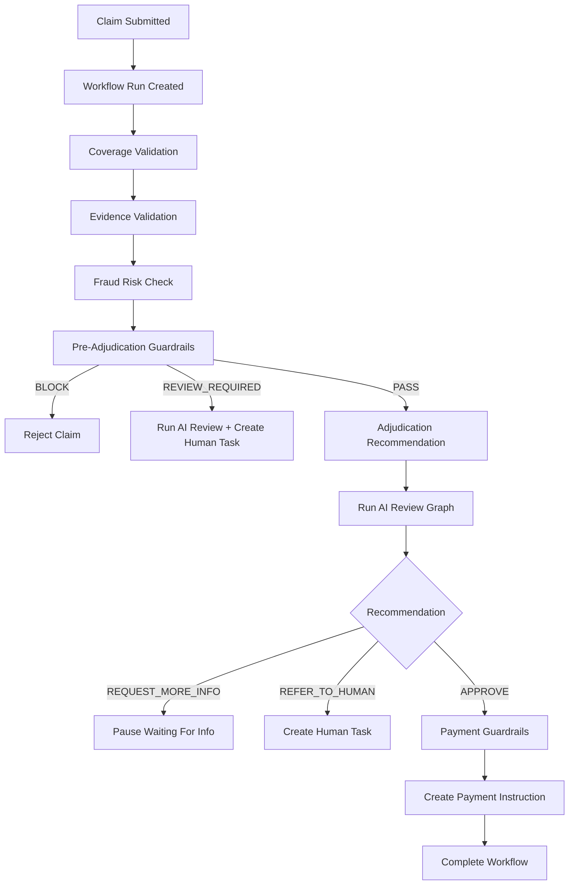
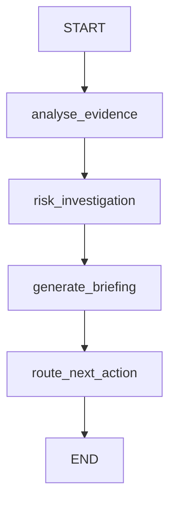
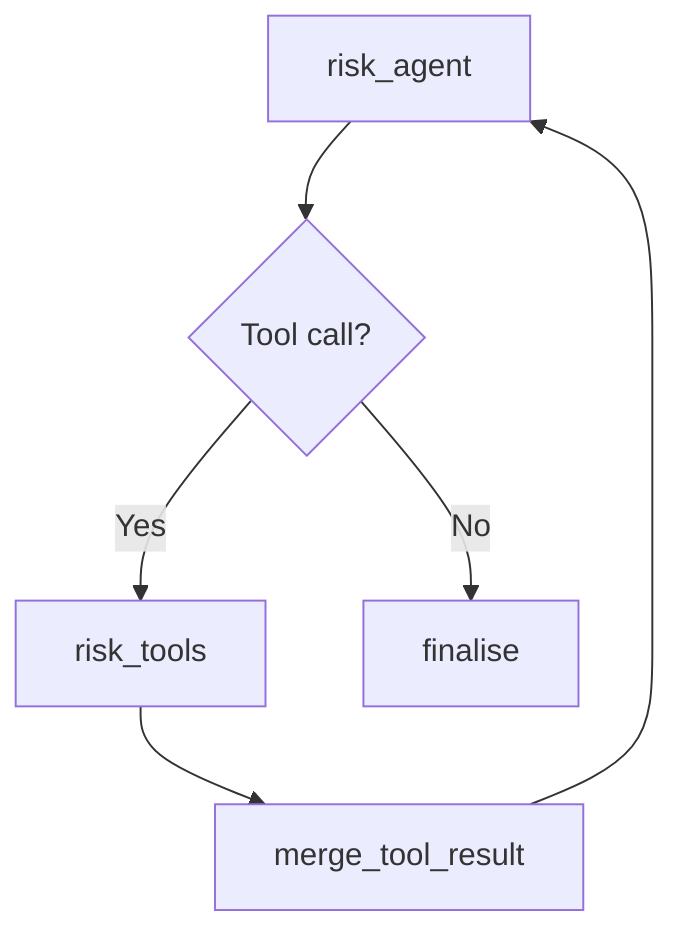
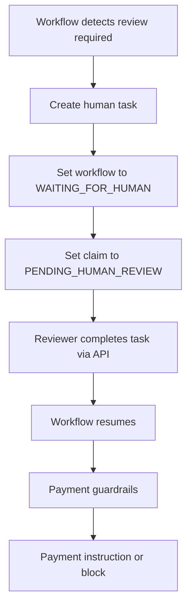

# Claims Control Tower Architecture

## Purpose

Claims Control Tower is a FastAPI-based backend for orchestrating insurance claim processing with a mix of:

- deterministic business workflow execution
- deterministic fraud, coverage, document, and payment guardrails
- human-review task management
- agentic AI analysis for internal support, not autonomous decision execution

The system is intentionally designed so that:

- workflow services execute business actions
- AI components analyze and recommend
- guardrails enforce constraints
- human reviewers authorize exceptions

This document describes the current implementation in the repository.

## High-Level Architecture

At a high level, the system has six major layers:

1. API layer
2. Workflow orchestration layer
3. Domain services and adapters
4. Agent graph layer
5. Persistence/repository layer
6. Audit and observability layer



## Core Design Principles

### 1. Deterministic workflow owns execution

Business execution is controlled by `WorkflowService`, not the LLM.

Examples of workflow-owned actions:

- update claim status
- create and complete workflow runs
- create human-review tasks
- validate payment guardrails
- create payment instructions
- mark workflows paused, resumed, failed, or completed

### 2. AI is advisory

The agent graph does not:

- approve claims
- reject claims
- modify payout
- create payment instructions
- override guardrails
- complete human tasks

It only produces:

- evidence analysis
- risk analysis
- adjuster briefing
- recommended next workflow action

### 3. Tools are read-only

The only tools exposed to the agent are read-only internal tools:

- `get_claim_history`
- `get_prior_rejection_details`
- `get_policy_coverage_summary`
- `get_document_metadata`
- `get_guardrail_results`

This is a deliberate safety boundary.

### 4. Human review remains first-class

If deterministic rules or workflow recommendations require human review, the workflow pauses and creates a human task. Resumption remains controlled by workflow code.

## Repository Layout

The most important directories are:

- [`app/api`](/Users/vikramsingh/claims_agentic_flow/claims-control-tower/app/api)
- [`app/services`](/Users/vikramsingh/claims_agentic_flow/claims-control-tower/app/services)
- [`app/agent`](/Users/vikramsingh/claims_agentic_flow/claims-control-tower/app/agent)
- [`app/models`](/Users/vikramsingh/claims_agentic_flow/claims-control-tower/app/models)
- [`app/schemas`](/Users/vikramsingh/claims_agentic_flow/claims-control-tower/app/schemas)
- [`app/repositories`](/Users/vikramsingh/claims_agentic_flow/claims-control-tower/app/repositories)
- [`app/tool`](/Users/vikramsingh/claims_agentic_flow/claims-control-tower/app/tool)
- [`tests`](/Users/vikramsingh/claims_agentic_flow/claims-control-tower/tests)

## Runtime Entry Point

The application entry point is [`app/main.py`](/Users/vikramsingh/claims_agentic_flow/claims-control-tower/app/main.py).

Responsibilities:

- create the FastAPI app
- register routers
- configure LangSmith tracing on startup/import
- expose `/health`

## API Layer

The API layer is split by concern:

- claims
- workflows
- human tasks
- payments
- audit

Examples:

- [`workflow_router.py`](/Users/vikramsingh/claims_agentic_flow/claims-control-tower/app/api/workflow_router.py)
- [`claims_router.py`](/Users/vikramsingh/claims_agentic_flow/claims-control-tower/app/api/claims_router.py)
- [`human_tasks_router.py`](/Users/vikramsingh/claims_agentic_flow/claims-control-tower/app/api/human_tasks_router.py)

The API layer is thin. It delegates almost all business logic to service classes.

## Workflow Orchestration Layer

The backbone of the system is [`WorkflowService`](/Users/vikramsingh/claims_agentic_flow/claims-control-tower/app/services/workflow_service.py).

### Responsibilities

`WorkflowService` is responsible for:

- starting workflow runs
- executing the claim workflow
- pausing and resuming workflow runs
- invoking deterministic validations
- invoking the AI review graph
- creating human-review tasks
- progressing approved claims to payment
- recording audit events

### Main Deterministic Flow

The current workflow shape is:



### Important Workflow Boundaries

The workflow uses the graph for internal AI analysis, but it does not let the graph directly mutate business state.

That means:

- graph output is interpreted by `WorkflowService`
- `WorkflowService` decides whether to persist events, create tasks, or proceed
- deterministic guardrails still override AI recommendations when needed

## Domain Services and Adapters

These services encapsulate business rules or external-system-like interactions.

### Core Services

- [`claim_service.py`](/Users/vikramsingh/claims_agentic_flow/claims-control-tower/app/services/claim_service.py)
- [`workflow_service.py`](/Users/vikramsingh/claims_agentic_flow/claims-control-tower/app/services/workflow_service.py)
- [`document_validation_service.py`](/Users/vikramsingh/claims_agentic_flow/claims-control-tower/app/services/document_validation_service.py)
- [`fraud_risk_service.py`](/Users/vikramsingh/claims_agentic_flow/claims-control-tower/app/services/fraud_risk_service.py)
- [`adjudication_service.py`](/Users/vikramsingh/claims_agentic_flow/claims-control-tower/app/services/adjudication_service.py)
- [`human_task_service.py`](/Users/vikramsingh/claims_agentic_flow/claims-control-tower/app/services/human_task_service.py)
- [`payment_guardrail_service.py`](/Users/vikramsingh/claims_agentic_flow/claims-control-tower/app/services/payment_guardrail_service.py)
- [`audit_service.py`](/Users/vikramsingh/claims_agentic_flow/claims-control-tower/app/services/audit_service.py)

### Mock Adapters

These are intentionally adapter-shaped so they can be replaced with real integrations later:

- [`policy_admin_adapter.py`](/Users/vikramsingh/claims_agentic_flow/claims-control-tower/app/services/policy_admin_adapter.py)
- [`claims_system_adapter.py`](/Users/vikramsingh/claims_agentic_flow/claims-control-tower/app/services/claims_system_adapter.py)
- [`payment_adapter.py`](/Users/vikramsingh/claims_agentic_flow/claims-control-tower/app/services/payment_adapter.py)

### Business Guardrails

Business guardrails are implemented under:

- [`app/services/business_guardrails`](/Users/vikramsingh/claims_agentic_flow/claims-control-tower/app/services/business_guardrails)

This layer is important because it represents deterministic operational controls rather than model output.

Examples of guardrails:

- policy active checks
- incident within coverage period
- large-claim review thresholds
- invoice-date anomaly checks
- repeat-claim review triggers
- payment amount checks
- duplicate payment prevention

## AI / Agent Architecture

The AI architecture is split into:

1. parent claims review graph
2. private risk investigation subgraph
3. prompt layer
4. tool layer

### Parent Claims Review Graph

The parent graph is defined in [`app/agent/state.py`](/Users/vikramsingh/claims_agentic_flow/claims-control-tower/app/agent/state.py).

The current parent graph is intentionally simple:



This is the top-level orchestration graph used by `WorkflowService`.

### Parent Graph State

The parent graph state is defined in [`claims_workflow_state.py`](/Users/vikramsingh/claims_agentic_flow/claims-control-tower/app/models/claims_workflow_state.py).

Important fields:

- `case_packet`
- `evidence_analysis`
- `risk_analysis`
- `tool_results`
- `previous_tool_calls`
- `adjuster_briefing`
- `recommended_next_action`
- `available_tools`
- `errors`

Even though the parent graph no longer owns tool-calling nodes, it still stores `tool_results` and `previous_tool_calls` because those are produced by the risk subgraph and used later by briefing, routing, and auditing.

### Risk Investigation Subgraph

The risk investigation subgraph is defined in [`risk_agent_graph.py`](/Users/vikramsingh/claims_agentic_flow/claims-control-tower/app/agent/risk/risk_agent_graph.py).

It is private to the `risk_investigation` node from the parent graph.

The subgraph shape is:



### Why the risk loop is private

This keeps the top-level graph easy to read:

- evidence analysis at the top level
- risk tool reasoning hidden inside the risk domain
- briefing and route recommendation at the top level

This is a good separation because tool-calling is a risk-investigation concern, not a general parent-graph concern.

### Risk Agent State

The subgraph state is defined in [`risk_agent_state.py`](/Users/vikramsingh/claims_agentic_flow/claims-control-tower/app/models/risk_agent_state.py).

Important fields:

- `case_packet`
- `messages`
- `tool_results`
- `previous_tool_calls`
- `risk_analysis`
- `llm_calls`

### Risk Agent Node

The reasoning node is implemented in [`risk_agent_node.py`](/Users/vikramsingh/claims_agentic_flow/claims-control-tower/app/agent/risk/risk_agent_node.py).

Its responsibilities:

- build a tool-decision prompt
- invoke a LangChain chat model bound to tools
- let the model decide whether to call a tool
- accumulate chat messages

### Tool Execution in the Risk Subgraph

Tool execution is performed using LangGraph `ToolNode`, not by custom hand-written orchestration in the parent graph.

This is one of the key architectural choices in the current version.

The flow is:

1. create chat model via [`chat_model_factory.py`](/Users/vikramsingh/claims_agentic_flow/claims-control-tower/app/services/AI/chat_model_factory.py)
2. bind tools with `bind_tools(RISK_AGENT_TOOLS)`
3. route tool calls to `ToolNode(RISK_AGENT_TOOLS)`
4. merge tool outputs back into graph state
5. ask the model again if another tool is needed
6. finalize structured risk analysis

### Structured Finalization

The final risk analysis uses:

- `model.with_structured_output(RiskAnalysisSchema)`

This produces a structured risk-analysis object rather than unstructured text.

## Prompt Layer

Prompt generation is split across:

- [`app/services/AI/prompts/adjuster_briefing_prompt.py`](/Users/vikramsingh/claims_agentic_flow/claims-control-tower/app/services/AI/prompts/adjuster_briefing_prompt.py)
- [`app/agent/risk/risk_agent_prompt.py`](/Users/vikramsingh/claims_agentic_flow/claims-control-tower/app/agent/risk/risk_agent_prompt.py)

### Prompt Responsibilities

Prompts are used for:

- evidence analysis
- risk tool decisioning
- risk finalization
- adjuster briefing generation
- next-action recommendation

The prompt layer is kept separate from nodes so that:

- node logic stays orchestration-focused
- prompt content stays easier to evolve independently

## Tool Layer

Read-only tools are defined in [`tools.py`](/Users/vikramsingh/claims_agentic_flow/claims-control-tower/app/tool/tools.py).

### Safe Tool Registry

The allowlist is:

```python
SAFE_READ_ONLY_TOOLS = {
    "get_claim_history": get_claim_history,
    "get_prior_rejection_details": get_prior_rejection_details,
    "get_policy_coverage_summary": get_policy_coverage_summary,
    "get_document_metadata": get_document_metadata,
    "get_guardrail_results": get_guardrail_results,
}
```

### Tool Responsibilities

#### `get_claim_history`

Returns recent claims for a customer.

Used for:

- repeat-claim risk
- prior-claim frequency analysis

#### `get_prior_rejection_details`

Returns prior rejection context for a linked previous claim.

Used for:

- reopened claim context
- prior denial review

#### `get_policy_coverage_summary`

Returns policy status, dates, deductible, limit, and covered claim types.

Used for:

- coverage ambiguity
- claim-type interpretation
- incident-date reasoning

#### `get_document_metadata`

Returns structured claim-document metadata.

Used for:

- invoice anomaly detection
- invoice amount inspection
- vendor review
- verification status checks

#### `get_guardrail_results`

Returns deterministic guardrail outcomes already recorded by the workflow.

Used for:

- understanding review triggers
- aligning AI explanation with deterministic controls

## Case Packet

The bridge between deterministic workflow and agentic review is the case packet.

The case packet schema lives in:

- [`case_packet_schema.py`](/Users/vikramsingh/claims_agentic_flow/claims-control-tower/app/schemas/case_packet_schema.py)

The builder lives in:

- [`case_packet.py`](/Users/vikramsingh/claims_agentic_flow/claims-control-tower/app/services/case_packet.py)

### Why the case packet matters

The graph does not reach directly into repositories or services for arbitrary business state.

Instead, the workflow builds a normalized case packet containing:

- claim summary
- policy summary
- documents
- coverage result
- evidence result
- risk result
- guardrail results
- adjudication recommendation
- claim history summary
- workflow_run_id

This gives the graph a stable input contract.

## Human Review Architecture

Human-review behavior is central to the platform.

### Human Review Trigger Sources

Human review can be triggered by:

- pre-adjudication business guardrails
- adjudication recommendation rules
- high-risk conditions
- payment review requirements

### Human Review Flow



### Human Task Data

Human tasks carry:

- task type
- priority
- reason
- risk factors
- recommended payout
- adjuster briefing
- reviewer decision
- reviewer notes
- reviewer-modified payout amount

## Audit Architecture

Audit is implemented through:

- [`audit_service.py`](/Users/vikramsingh/claims_agentic_flow/claims-control-tower/app/services/audit_service.py)
- [`workflow_event.py`](/Users/vikramsingh/claims_agentic_flow/claims-control-tower/app/models/workflow_event.py)

### Why audit matters

This system models a regulated workflow. Internal explainability and traceability are essential.

### Recorded Event Types

Examples include:

- `workflow_started`
- `policy_validated`
- `documents_validated`
- `fraud_rules_evaluated`
- `business_guardrails_evaluated`
- `recommendation_created`
- `human_task_created`
- `workflow_paused`
- `workflow_waiting_for_human`
- `payment_instruction_created`

AI-specific events include:

- `ai_evidence_analysis_completed`
- `ai_risk_analysis_completed`
- `ai_information_gaps_identified`
- `ai_tool_executed`
- `ai_adjuster_briefing_generated`
- `adjuster_briefing_created`

This means the workflow event stream is both:

- operational audit log
- AI reasoning trace at the business-event level

## Observability

LangSmith observability is configured in:

- [`observability.py`](/Users/vikramsingh/claims_agentic_flow/claims-control-tower/app/services/observability.py)

### What is traced

Examples of traced functions include:

- workflow execution
- claims review graph invocation
- graph nodes
- tools

This gives visibility into:

- workflow-level execution
- graph-level execution
- tool selection and execution
- model interactions

## Persistence Model

The application currently uses repository classes over the project’s internal store abstraction rather than a production database integration.

Important repositories:

- [`claim_repository.py`](/Users/vikramsingh/claims_agentic_flow/claims-control-tower/app/repositories/claim_repository.py)
- [`workflow_repository.py`](/Users/vikramsingh/claims_agentic_flow/claims-control-tower/app/repositories/workflow_repository.py)
- [`human_task_repository.py`](/Users/vikramsingh/claims_agentic_flow/claims-control-tower/app/repositories/human_task_repository.py)
- [`payment_repository.py`](/Users/vikramsingh/claims_agentic_flow/claims-control-tower/app/repositories/payment_repository.py)
- [`policy_repository.py`](/Users/vikramsingh/claims_agentic_flow/claims-control-tower/app/repositories/policy_repository.py)

This keeps the code organized around persistence interfaces even before moving to a production-grade database.

## Important Data Models

### Claim

The claim model includes:

- claim details
- lifecycle status
- `rejection_reason`
- `approved_reason`

### Workflow Run

Represents a long-lived business workflow that can be:

- started
- paused
- resumed
- failed
- completed

### Workflow Event

Represents immutable audit/history entries attached to a workflow run.

### Human Task

Represents manual review work items for adjusters or reviewers.

### Payment Instruction

Represents approved payment instructions created after payment guardrails pass.

## End-to-End Flow Summary

From claim submission to completion, the system works like this:

1. Claim is submitted.
2. Workflow run is created.
3. Coverage is validated.
4. Documents are validated.
5. Fraud rules are evaluated.
6. Deterministic business guardrails are evaluated.
7. If blocked, claim is rejected.
8. If review is required, AI review runs and a human task is created.
9. If guardrails pass, adjudication recommendation is created.
10. Parent claims review graph runs.
11. Private risk subgraph may use read-only tools.
12. Graph generates adjuster briefing and next-action recommendation.
13. Workflow decides whether to request more info, pause for human, or proceed.
14. Payment guardrails run for approved outcomes.
15. Payment instruction is created when allowed.
16. Audit trail is stored throughout.

## Current Strengths of the Architecture

- clear boundary between deterministic workflow and AI reasoning
- private subgraph for risk tool-calling keeps parent graph simple
- read-only tools reduce operational risk
- strong audit trail
- adapter pattern supports later real integrations
- human-review flow is modeled as a first-class business concept
- LangSmith tracing is already integrated

## Current Tradeoffs and Limitations

- the project still relies on mocked adapters and internal repositories rather than production integrations
- some AI paths still use synchronous model calls and can be slow under Ollama
- the graph is advisory only, which is the right safety choice now, but limits automation depth
- the workflow service is the main orchestration spine and is correspondingly large

## Future Evolution Paths

Likely future directions include:

- move mocked adapters to real claims, policy, and payment integrations
- add persistent database storage behind repositories
- refine prompt quality and structured output reliability
- improve model latency and retry handling
- split large workflow logic into smaller orchestration helpers
- add more specialized private subgraphs only when justified
- add evaluation suites for graph quality and recommendation correctness

## Recommended Mental Model

The easiest way to understand the system is:

- `WorkflowService` is the business engine
- the parent graph is the AI review pipeline
- the risk subgraph is the only place where tool-using agent behavior currently lives
- tools are read-only facts retrievers
- audit events are the source of truth for explainability
- human tasks are the enterprise control point

That mental model matches the current codebase closely and should make future changes easier to reason about.
